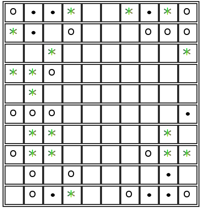

# gameoflife
Приложение использует springframework.boot

Порядок компиляции:

1. Если не установлен, установить Inno Setup (версия не ниже 5) http://www.jrsoftware.org/isdl.php 
2. Добавить в путь поиска, если нет, mvn и javapackager
2. mvn clean package
3. javapackager -deploy -native exe -outdir ./executable -srcfiles gameoflife-1.0-SNAPSHOT.jar -outfile gameoflife-1.0-SNAPSHOT-0.0.1 -name gameoflife-1.0-SNAPSHOT -title "Game of life" -appclass org.springframework.boot.loader.JarLauncher -v

Порядок запуска:
1. Запустить приложение.
2. Открыть в браузере http://127.0.0.1:8080

